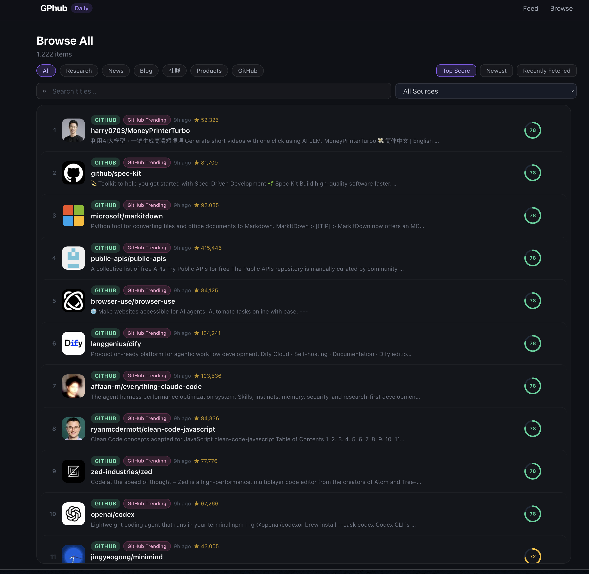

# GPhub

A self-hosted tool that collects, scores and summarises the latest AI news, research papers and tools — twice a day.





## Architecture

```
Scheduler (APScheduler)
    └── Crawlers (crawl4ai + feedparser)
            ├── RSS: HN, ArXiv, MIT TR, VentureBeat, Product Hunt
            └── Web: GitHub Trending
    └── Scoring Engine  (impact 40% · credibility 35% · novelty 25%)
    └── Summariser      (Claude Haiku)

FastAPI  ──► Next.js (http://localhost:3000)
PostgreSQL + pgvector
```

## Scoring

| Dimension | Weight | Signal |
|---|---|---|
| Impact | 40% | GitHub stars, social shares, citations |
| Credibility | 35% | Source tier (Tier 1 = 100, Tier 2 = 65, Tier 3 = 30) |
| Novelty | 25% | Exponential decay from publish time (48h half-life) + category boost |

## Quick Start

```bash
# 1. Copy and fill in your API key
cp .env.example .env
# Edit .env and set ANTHROPIC_API_KEY

# 2. Start everything
docker compose up -d

# 3. Open the web UI
open http://localhost:3000

# 4. Manually trigger a crawl (optional, no need to wait for scheduler)
curl -X POST http://localhost:8000/api/v1/trigger-crawl
```

## Development

### Backend (Python 3.12)

```bash
cd backend
python -m venv .venv && source .venv/bin/activate
pip install -r requirements.txt
playwright install chromium

# Run with a local Postgres (update DATABASE_URL in .env)
uvicorn app.main:app --reload
```

### Run tests

```bash
cd backend
pytest tests/ -v
```

### Frontend (Next.js 14)

```bash
cd frontend
npm install
NEXT_PUBLIC_API_URL=http://localhost:8000 npm run dev
```

## Environment Variables

| Variable | Default | Description |
|---|---|---|
| `ANTHROPIC_API_KEY` | — | Required. Claude Haiku API key |
| `POSTGRES_USER` | `gphub` | DB user |
| `POSTGRES_PASSWORD` | `gphub_secret` | DB password |
| `POSTGRES_DB` | `gphub` | DB name |

## API Endpoints

| Method | Path | Description |
|---|---|---|
| GET | `/api/v1/items` | Paginated item feed (filterable) |
| GET | `/api/v1/items/{id}` | Single item detail |
| GET | `/api/v1/stats` | Aggregate stats |
| GET | `/api/v1/crawl-runs` | Recent crawl history |
| POST | `/api/v1/trigger-crawl` | Manually trigger a crawl |
| GET | `/health` | Health check |

## Scheduler

| Job | Schedule (UTC) | Description |
|---|---|---|
| `crawl_and_summarise` | 06:00 and 18:00 | Full pipeline: crawl → score → thumbnail → comment → digest |
| `archive_old_items` | 03:00 daily | Delete stale items to keep the DB lean (see Archive below) |

Change crawl hours via `SCHEDULE_HOURS` in `.env` or `backend/app/config.py`.

## Archive Strategy

The `items` table grows continuously with every crawl. To prevent unbounded growth and keep feed queries fast, a nightly archive job runs at **03:00 UTC** and hard-deletes rows past their retention window.

| Content type | Retention | Rationale |
|---|---|---|
| All non-GitHub categories | **30 days** (`ARCHIVE_DAYS`) | News, papers, blog posts lose relevance quickly |
| `github_project` | **60 days** (`ARCHIVE_DAYS × 2`) | Repos are slower-moving; star history is preserved longer |

`star_snapshots` rows are cascade-deleted automatically via the FK `ON DELETE CASCADE`.

**Configuration** — override the default in `.env`:

```env
ARCHIVE_DAYS=30   # non-github retention in days (github = 2×)
```

**At typical crawl volume** (~70 new items/day, 2 runs × ~35 items):

| Days of data | Approx. rows | Feed query time |
|---|---|---|
| 7 days | ~490 | < 50 ms |
| 30 days | ~2,100 | ~100 ms |
| Unbounded (no archive) | 25,000+/year | degrades linearly |

The archive job deletes `github_project` items separately with a 2× longer window so trending repos stay discoverable even if they weren't crawled every day.

## Frontend Layout

### Feed Page (`/`)

```
┌─────────────────────────────────────────────────────────────────────┐
│  This Week in AI                              Browse all →           │
│  Top trending topics · past 7 days                                   │
└─────────────────────────────────────────────────────────────────────┘

━━━━━━━━━━━━━━━━━━━━━━━━━━━━━  TRENDING TOPICS  ━━━━━━━━━━━━━━━━━━━━━━
  algorithm-ranked · past 7 days

  ┌──────────────────────────────┬─────────────┬─────────────┐
  │                              │     #2      │     #3      │
  │             #1               │  SmallCard  │  SmallCard  │
  │          MainHero            ├─────────────┴─────────────┤
  │        (6col × 2row)         │             #4            │
  │                              │          WideCard         │
  ├────────────┬────────┬────────┼─────────────┬─────────────┤
  │    M-1     │  M-2   │  M-3  │     #5      │     #6      │
  │  MedCard   │ MedCard│MedCard│  SmallCard  │  SmallCard  │
  └────────────┴────────┴───────┴─────────────┴─────────────┘

  #1–#6  = Topic cards (no github_project — see GitHub Rising below)
  M-1–M-3 = Top trending items (any category, deduplicated)

━━━━━━━━━━━━━━━━━━━━━━━━━━━━━  AI WEEKLY DIGEST  ━━━━━━━━━━━━━━━━━━━━━
  powered by Gemini  ·  Week XX, YYYY
  (hidden when no digest data available)

  ┌──────────────────────────────────────────────────────────┐
  │  [Featured event title]                                  │
  │  AI analysis text (100-200 chars) ...                    │
  │  Related: [article 1] [article 2] [article 3]           │
  ├────────────────────┬─────────────────────────────────────┤
  │  [Event 2 title]   │  [Event 3 title]  │  [Event 4]     │
  │  Short analysis... │  Short analysis...│  ...           │
  └────────────────────┴───────────────────┴────────────────┘

━━━━━━━━━━━━━━━━━━━━  LATEST · BLOG  (top 4 by score)  ━━━━━━━━━━━━━━━
  ┌──────────┬──────────┬──────────┬──────────┐
  │ MedCard  │ MedCard  │ MedCard  │ MedCard  │
  └──────────┴──────────┴──────────┴──────────┘

━━━━━━━━━━━━━━━━━━━  LATEST · GITHUB  (top 4 by score)  ━━━━━━━━━━━━━━
  ┌──────────┬──────────┬──────────┬──────────┐
  │ MedCard  │ MedCard  │ MedCard  │ MedCard  │
  └──────────┴──────────┴──────────┴──────────┘

━━━━━━━━━━━━━━━━━━  LATEST · PRODUCTS  (top 4 by score)  ━━━━━━━━━━━━━
  ┌──────────┬──────────┬──────────┬──────────┐
  │ MedCard  │ MedCard  │ MedCard  │ MedCard  │
  └──────────┴──────────┴──────────┴──────────┘

━━━━━━━━━━━━━━━━━━━  LATEST · NEWS  (top 4 by score)  ━━━━━━━━━━━━━━━━
  ┌──────────┬──────────┬──────────┬──────────┐
  │ MedCard  │ MedCard  │ MedCard  │ MedCard  │
  └──────────┴──────────┴──────────┴──────────┘
```

### Trending Topics Grid (12-column)

```
col:  1    2    3    4    5    6    7    8    9   10   11   12
     ┌────────────────────────────┬─────────────┬─────────────┐
row1 │                            │     #2      │     #3      │
     │            #1              │  SmallCard  │  SmallCard  │
row2 │        MainHero            ├─────────────┴─────────────┤
     │      (6col × 2row)         │           #4              │
     │                            │        WideCard           │
     ├──────────┬──────────┬──────┤   (6col × 1row)           │
row3 │   M-1    │   M-2    │  M-3 ├─────────────┬─────────────┤
     │  Medium  │  Medium  │ Med  │     #5      │     #6      │
     │   Card   │   Card   │ Card │  SmallCard  │  SmallCard  │
     └──────────┴──────────┴──────┴─────────────┴─────────────┘

#1  TopicMainHero  — col 1-6,  row 1-2  (large hero, full image + AI comment)
#2  TopicSmallCard — col 7-9,  row 1
#3  TopicSmallCard — col 10-12, row 1
#4  TopicWideCard  — col 7-12, row 2    (wide landscape card)
#5  TopicSmallCard — col 7-9,  row 3
#6  TopicSmallCard — col 10-12, row 3
M   MediumCard     — col 1-6,  row 3    (3 trending items, not topic cards)
```

**Card types:**

| Card | Ranks | Size | Image fallback |
|---|---|---|---|
| `TopicMainHero` | #1 | 6col × 2row | Category gradient + emoji |
| `TopicSmallCard` | #2 #3 #5 #6 | 3col × 1row | Category gradient |
| `TopicWideCard` | #4 | 6col × 1row | Category gradient |
| `MediumCard` | M-1 M-2 M-3 | 2col × 1row | No image |

Images fall back to category gradient when thumbnail is unavailable or low-quality
(GitHub avatars, Reddit icons, Dev.to white-background OG images are excluded).

### AI Comment Routing

```
Category          Client              Daily quota
──────────────    ──────────────────  ───────────
news_article   →  Cerebras (primary)  14,400 req
blog_post      →  Cerebras / Groq     14,400 req  (paywall items skipped)
research_paper →  Cerebras / Groq     14,400 req
product_launch →  Cerebras / Groq     14,400 req
community      →  Cerebras / Groq     14,400 req
github_project →  Gemini 2.0 Flash      1500 req  (falls back to Cerebras/Groq if quota gone)

Top 60 items per category per crawl run.
Already-commented items are never re-processed.
```

## Adding a New Source

1. Add a row to `backend/migrations/init.sql` (for new installs) **or** `INSERT` directly into the `sources` table.
2. For RSS feeds, add an entry to `RSS_SOURCES` in `backend/app/crawlers/rss_crawler.py`.
3. For complex sites, create a new file in `backend/app/crawlers/` inheriting `BaseCrawler`.
